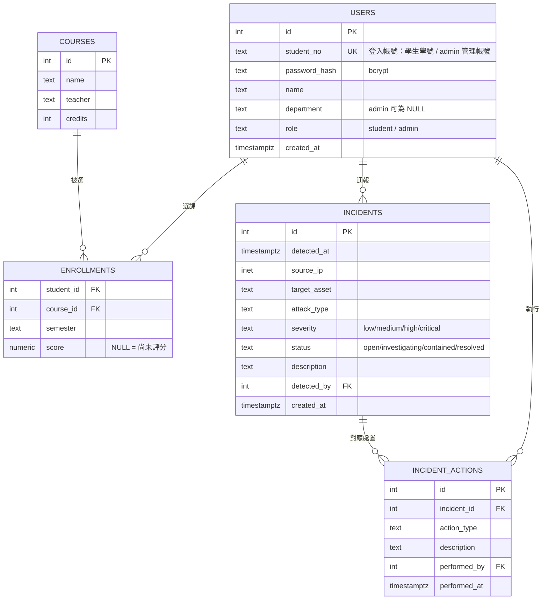

# 校園網 資料庫設計文件 (SDD)

版本：v0.1（草案）
負責人：資料庫團隊
關聯文件：`campus-webserver-sdd.md`（Webserver / Docker Compose 架構）、`db/init/001_init_schema.sql`（實際 schema）

---

## 一、文件目的

本文件說明「校園網」資安攻防演練專案的資料庫設計，範圍涵蓋：

- 資料表結構與欄位定義
- 資料表之間的關聯設計
- 假資料 / 測試帳號一覽
- Schema 修改與版本管理慣例
- 待辦事項

不包含 Webserver 容器編排、Nginx 路由、API 應用邏輯，這些請參考 `campus-webserver-sdd.md`。

---

## 二、資料庫在整體架構中的位置

沿用 `campus-webserver-sdd.md` 的網路設計：`postgres` 只掛在 `data-net`，只有 `course-api` / `student-api` 能連進來，前端容器與外部完全碰不到資料庫本身（沒有對外開 port）。要測試資料，一律透過 API，不直接開放資料庫連線。

```text
course-api ─┐
            ├── data-net ── postgres (5432, 僅內部)
student-api ─┘
```

---

## 三、ER 圖



---

## 四、資料表詳細定義

### 4.1 `users`

學生與後台管理員合併成同一張表，用 `role` 區分身份，登入時共用同一套查詢邏輯。

| 欄位 | 型態 | 說明 |
|---|---|---|
| `id` | SERIAL PK | 內部主鍵 |
| `student_no` | TEXT, UNIQUE, NOT NULL | 登入帳號。格式統一「1 碼角色代碼 + 8 碼數字」：學生 `B` 開頭（如 `B11123001`），admin `A` 開頭（如 `A00000001`） |
| `password_hash` | TEXT, NOT NULL | bcrypt hash（`$2a$`/`$2b$`），種子資料用 Postgres `pgcrypto` 產生，正式邏輯用 Node `bcryptjs` |
| `name` | TEXT, NOT NULL | 姓名 |
| `department` | TEXT | 系所，admin 可為 NULL |
| `role` | TEXT, NOT NULL, DEFAULT `student` | `CHECK (role IN ('student','admin'))` |
| `created_at` | TIMESTAMPTZ, DEFAULT now() | 建立時間 |

### 4.2 `courses`

| 欄位 | 型態 | 說明 |
|---|---|---|
| `id` | SERIAL PK | |
| `name` | TEXT, NOT NULL | 課程名稱 |
| `teacher` | TEXT | 授課教師 |
| `credits` | INTEGER | 學分數 |

### 4.3 `enrollments`（選課 + 成績）

一筆選課紀錄同時帶成績，`score` 為 NULL 代表尚未評分。

| 欄位 | 型態 | 說明 |
|---|---|---|
| `student_id` | INTEGER, FK → `users(id)` | 選課的學生 |
| `course_id` | INTEGER, FK → `courses(id)` | 課程 |
| `semester` | TEXT | 學期，目前自由格式（如 `2025-2`） |
| `score` | NUMERIC(5,2) | 成績，NULL = 尚未評分 |
| PK | `(student_id, course_id)` | 一個學生同一門課只會有一筆紀錄 |

### 4.4 `incidents`（入侵事件）

藍隊記錄每一次偵測到的攻擊事件。

| 欄位 | 型態 | 說明 |
|---|---|---|
| `id` | SERIAL PK | |
| `detected_at` | TIMESTAMPTZ, NOT NULL | 偵測時間 |
| `source_ip` | INET | 攻擊來源 IP |
| `target_asset` | TEXT | 被攻擊目標，如 `nginx` / `course-api` / `postgres` |
| `attack_type` | TEXT | 攻擊類型，目前自由填寫（如 `SQL Injection`），未來視演練情境可收斂成固定分類 |
| `severity` | TEXT | `CHECK (severity IN ('low','medium','high','critical'))` |
| `status` | TEXT, NOT NULL, DEFAULT `open` | `CHECK (status IN ('open','investigating','contained','resolved'))` |
| `description` | TEXT | 事件描述 |
| `detected_by` | INTEGER, FK → `users(id)` | 通報 / 發現此事件的 admin，系統自動偵測（如 Wazuh）可留 NULL |
| `created_at` | TIMESTAMPTZ, DEFAULT now() | |

### 4.5 `incident_actions`（系統調整 / 應變措施）

一個 incident 可以對應多筆處置紀錄（一對多），方便事後拉出完整時間軸。

| 欄位 | 型態 | 說明 |
|---|---|---|
| `id` | SERIAL PK | |
| `incident_id` | INTEGER, NOT NULL, FK → `incidents(id)` | 對應哪個事件 |
| `action_type` | TEXT | 處置類型，如 `封鎖IP` / `修補漏洞` / `重啟服務` |
| `description` | TEXT, NOT NULL | 實際做了什麼、為什麼這樣做 |
| `performed_by` | INTEGER, FK → `users(id)` | 執行此措施的 admin |
| `performed_at` | TIMESTAMPTZ, NOT NULL, DEFAULT now() | 執行時間 |

### 4.6 索引

| 索引 | 用途 |
|---|---|
| `idx_incidents_status` | 依狀態篩選事件（如列出所有 `open` 的事件） |
| `idx_incidents_detected_at` | 依時間排序 / 篩選事件 |
| `idx_incident_actions_incident_id` | 查某個事件底下的所有處置紀錄 |

---

## 五、設計取捨說明

- **`students` / `admins` 合併成 `users`**：原本規劃是分開兩張表，後來改成單一表 + `role` 欄位，理由是登入邏輯（`/login`）可以共用同一套查詢，不用維護兩套認證流程。代價是 `department` 對 admin 沒有意義（留 NULL）。
- **成績放在 `enrollments` 而不是獨立 `grades` 表**：目前需求是「一門課一個成績」，用獨立表沒有額外好處；如果之後有多次評分（期中/期末分開存）才需要拆表。
- **`incidents` / `incident_actions` 拆兩張表**：因為一個事件通常對應「多個」處置動作（先擋 IP、再修漏洞、再持續觀察），拆表才能存一對多關係，也方便之後做事件時間軸報表。
- **`attack_type` / `action_type` 用自由文字而非 ENUM**：演練情境還在變動，先不鎖死分類，避免每次加新攻擊類型都要改 schema；等分類穩定後可以收斂成 `CHECK` 約束或查找表。

---

## 六、假資料 / 測試帳號

種子資料在 `db/init/001_init_schema.sql`，所有測試帳號密碼統一是 **`Passw0rd!`**（僅供本機開發測試，正式環境絕對不能用）。

| student_no | 姓名 | 系所 | 身份 |
|---|---|---|---|
| B11123001 | 陳同學 | 資訊工程系 | student |
| B11123002 | 林同學 | 資訊工程系 | student |
| B11123003 | 黃同學 | 電機工程系 | student |
| B11123004 | 張同學 | 企業管理系 | student |
| B11123005 | 李同學 | 應用外語系 | student |
| B11123006 | 王同學 | 資訊管理系 | student |
| B11123007 | 吳同學 | 機械工程系 | student |
| B11123008 | 劉同學 | 財務金融系 | student |
| B11123009 | 蔡同學 | 大眾傳播系 | student |
| B11123010 | 楊同學 | 運動科學系 | student |
| A00000001 | 系統管理員 | — | admin |

另外附帶：2 門課程、每位學生 1~2 筆選課成績（含幾筆 NULL 示範未評分）、2 筆入侵事件 + 3 筆對應應變措施。

---

## 七、Schema 修改慣例

`db/init/` 底下的檔案只在 Postgres volume**第一次啟動、資料夾是空的**時才會自動執行（Postgres 官方 image 的 `docker-entrypoint-initdb.d` 機制）。因此：

- **本機開發階段**：改完 `.sql` 直接 `docker compose down -v && docker compose up --build` 重來即可看到最新 schema。
- **schema 定案、有人已經在用之後**：不要直接改舊檔案，改用新增編號檔的方式擴充，例如 `002_add_xxx.sql`、`003_add_yyy.sql`，維持可追蹤、可重放。

---

## 八、待辦事項 (Open Items)

- [ ] `incidents` / `incident_actions` 目前只有資料庫層，`course-api` / `student-api` 都還沒開對應的 API 端點
- [ ] `/login` 驗證通過後尚未核發 session / JWT，Redis 已經在 `docker-compose.yml` 裡但還沒接上
- [ ] `attack_type` / `severity` 的分類要等演練情境定案後再考慮收斂成固定選項
- [ ] `enrollments.semester` 目前是自由文字，之後如果要跨學期查詢統計，考慮拆成 `academic_year` + `term` 兩個欄位
